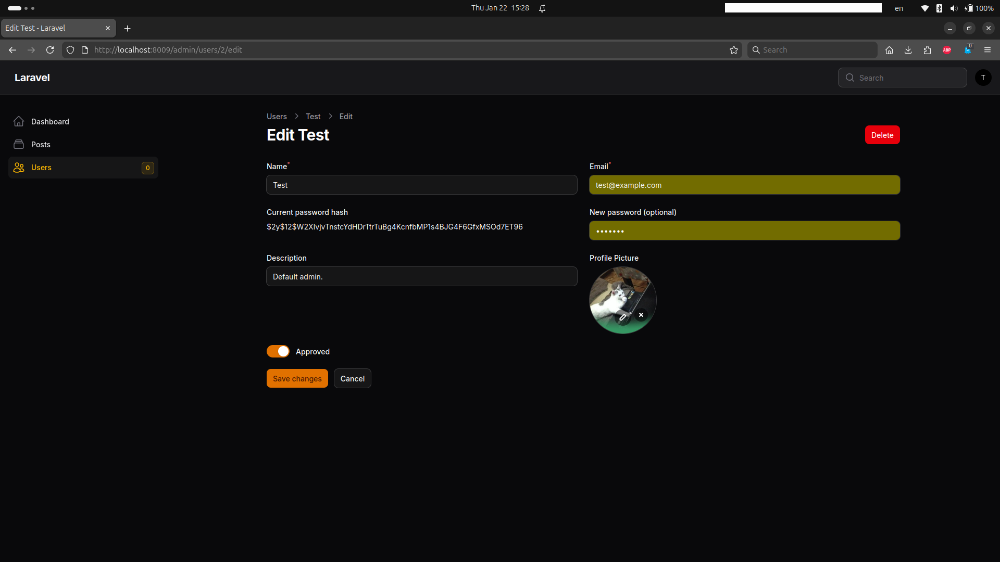
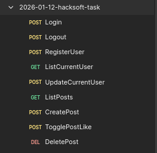
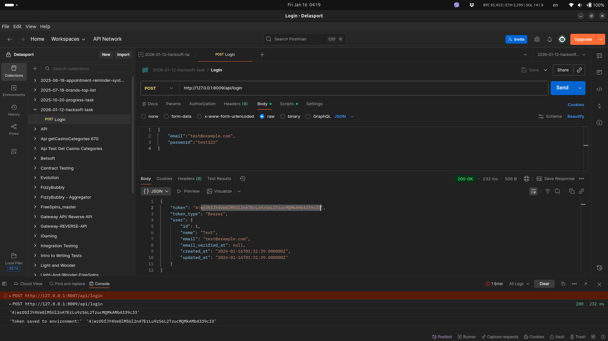
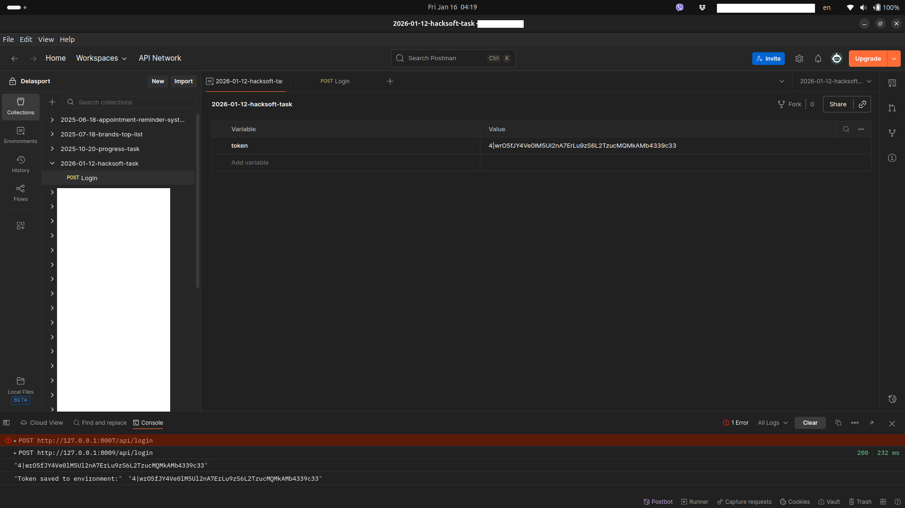
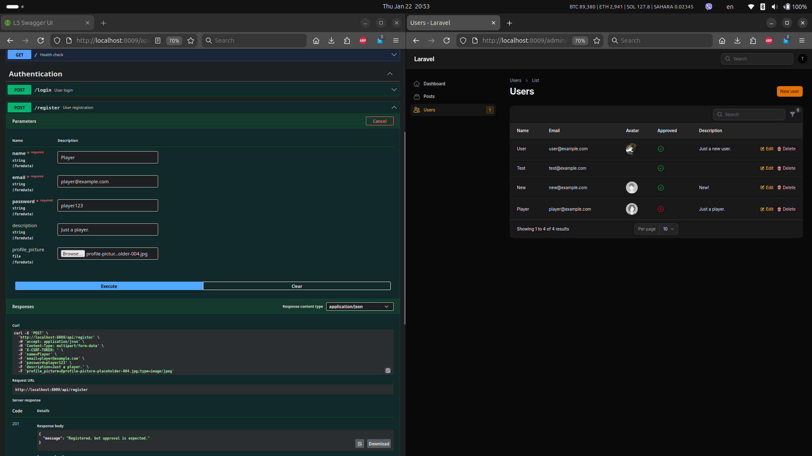
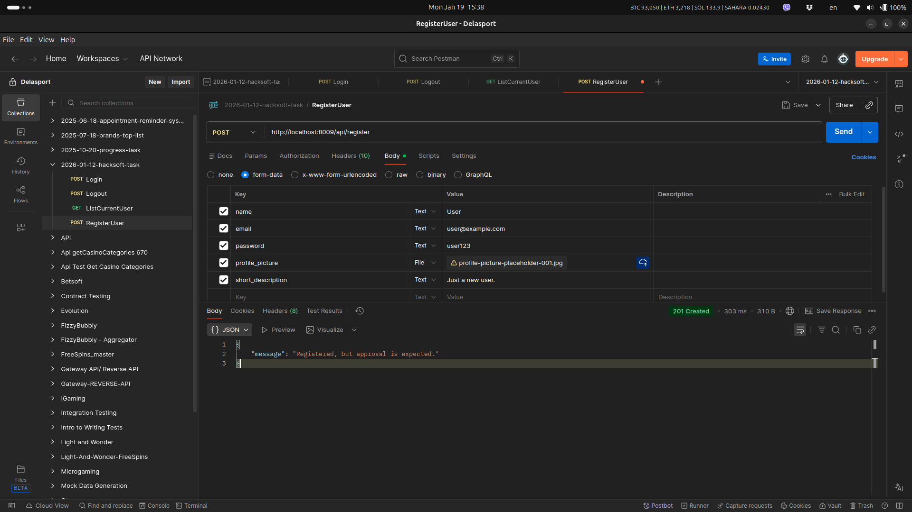
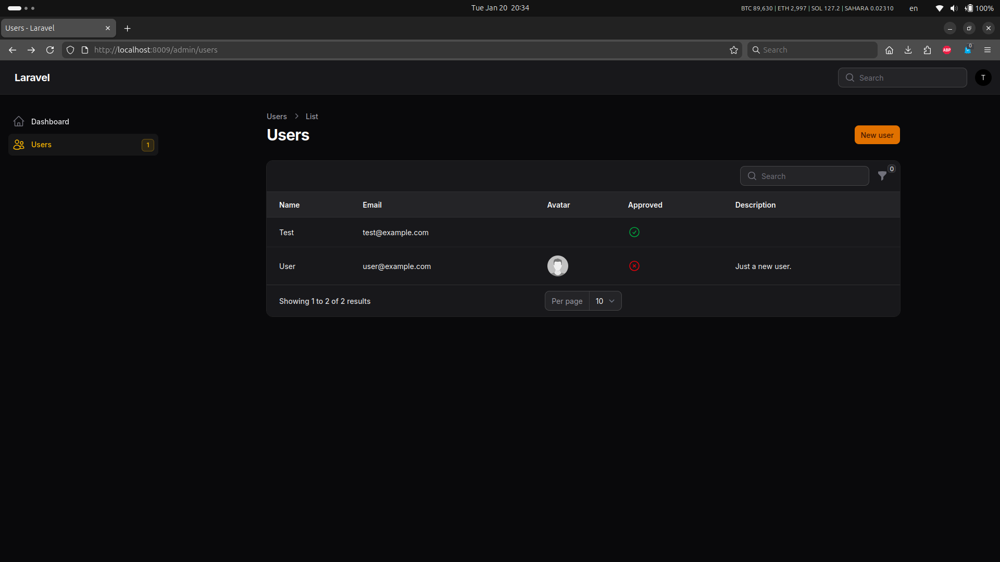
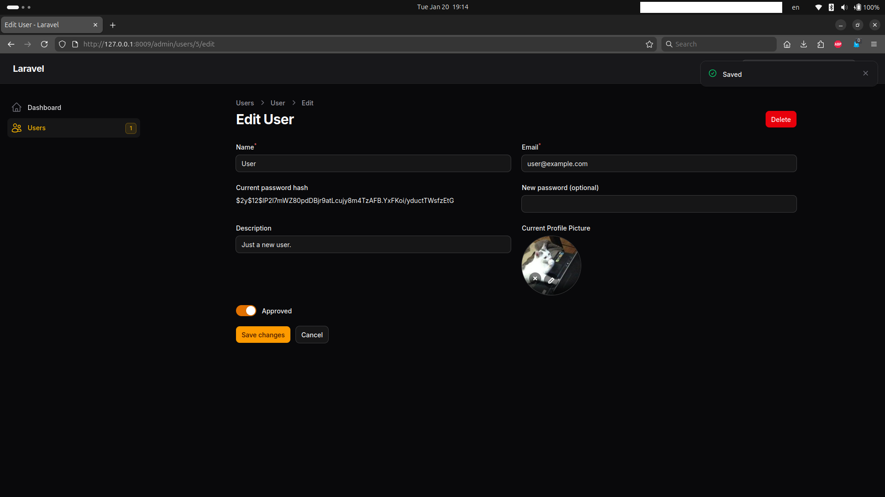
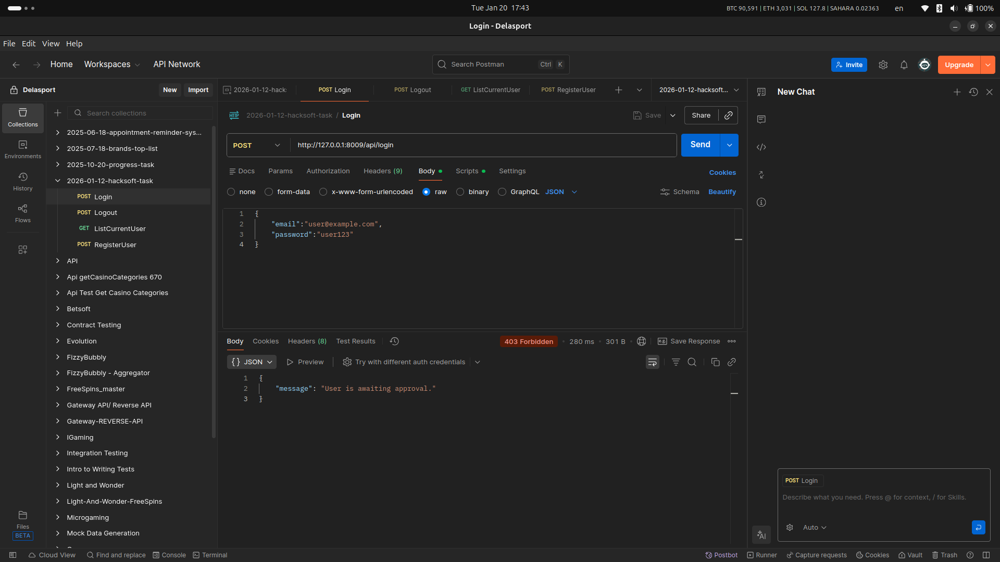
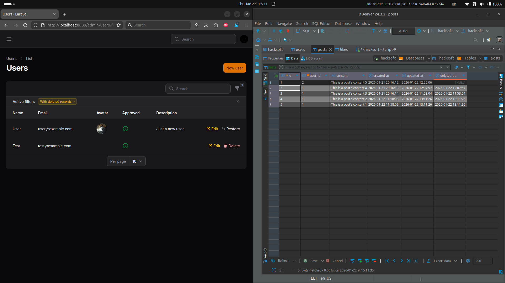

# REST API for social media application



## Setup
```
git clone https://github.com/killedit/2026-01-12-hacksoft-task.git
cd 2026-01-12-hacksoft-task
docker compose up -d --build
```
If you want to follow the docker container logs remove the `-d` flag so you don't detach at the build process.

The application should run migrations and seeders.</br>

The back-end Laravel Rest API should run at:</br>
`http://127.0.0.1:8009`

## Overall project structure:

```
2026-01-12-hacksoft-task
    /docker
        /nginx
            default.conf            # Nginx. Reverse proxy.
        /php
            /conf.d
                xdebug.ini          # Xdebug. Test coverage.
            entrypoint-laravel.sh   # Bash script that runs migrations and seeders in the Laravel container.
            entrypoint-worker.sh    # The scheduler and the queue only need to wait for working MySQL.
    /laravel                        # Back-end application.
        Dockerfile                  # Backend container setup.
        .env                        # Laravel specific settings.
    /{fronend}                      # Future {frontend}.
    docker-compose.yaml             # Where all containers are definied.
    .env                            # This is needed for MySQL docker container initialization.
```

## Connect to the database

Option 1: Connect to `hacksoft-mysql-1` container:

```
docker exec -it hacksoft-mysql-1 bash
mysql -u root -p
    admin123
use hacksoft;
show tables;
...
```

Option 2: Create a new db connection in DBeaver.

```
Server Host:    127.0.0.1
Port:           3309
Database:       hacksoft
Username:       laravel_user
Password:       user123

Driver properties:
    allowPublicKeyRetrieval     TRUE
    useSSL                      FALSE

Test Connection...
```

Relationship Diagram of the tables:
```
Users
- hasMany (Posts) - we need # of posts by one user (task requirements)
- hasMany (Likes) - we need # of likes on posts created by that one user (task requirements)

Posts
- belongsTo (User) - userFK
- belongsToMany (Users) - likes via pivot table

Likes
- belongsTo (User) - userFK
- belongsTo (Post) - postFK
```

## REST API resources

I have created a `Test` user that should play the role of admin with email `test@example.com` and password `test123` in db seeder.

| Method | Endpoint | Controller | Description |
| --- | --- | --- | --- |
| `POST` | `/api/login` | AuthController@login | Login with an approved user. |
| `POST` | `/api/logout` | AuthController@logout | Logout currently loggedin user. |
| `POST` | `/api/register` | AuthController@register | Register a unapproved user. |
| `GET` | `/api/me` | ProfileController@show | List current user's full data. |
| `POST` | `/api/me` | ProfileController@update | Change loggedin user's name, description and profile_picture. PATCH will not work here. |
| `GET` | `/api/posts{?cursor=prev_next_cursor_value}` | PostController@index | List all posts with `likers_count`, `likers` and `author`. User cursor in the response for pagination. |
| `POST` | `/api/posts` | PostController@store | Create a post. |
| `POST` | `/api/posts/{post_id}/like` | PostController@toggleLike | Toggle like/dislike on a post. |
| `DELETE` | `/api/posts/{post_id}/delete` | PostController@destroy | Delete a post. User can delete only posts they have created. |


### How to test the API endpoints

1. Curl.
- {} dynamic values

```bash
curl -X POST http://127.0.0.1:8009/api/login \
  -H 'Content-Type: application/json' \
  -d '{"email":"test@example.com","password":"test123"}'

curl -X POST http://127.0.0.1:8009/api/logout \
  -H "Authorization: Bearer 2|n8647i0Fc4o8GSiCphPRuSTuyqlqfhVjvZBolvUGce02f90f" \
  -H "Content-Type: application/json"

curl -X POST http://127.0.0.1:8009/api/register \
  -H 'Accept: application/json'
  -H 'Content-Type: application/json' \
  -F 'name="User"' \
  -F 'email="user@example.com"' \
  -F 'password="user123"' \
  -F 'description="Just a new user."' \
  -F 'profile_picture=@"/absolute/path/to/photo.jpg"'

curl -X GET http://127.0.0.1:8009/api/me \
  -H 'Content-Type: application/json' \
  -H 'Authorization: Bearer 6|tIPBGCSUJZSRJZLv33oIFmouJKuWCEkSTAGKaBN87d29ffb3'

# This "hack" below is because of the file upload. $_FILES parsing only works for POST. PATCH + JSON will make text-only uploads and the requirements ask to be able to change everything without email and password.

curl -X POST  http://127.0.0.1:8009/api/me \
  -H 'Accept: application/json'
  -H 'Content-Type: application/json' \
  -H 'Authorization: Bearer 6|tIPBGCSUJZSRJZLv33oIFmouJKuWCEkSTAGKaBN87d29ffb3'
  -F '_method="PATCH"' \
  -F 'name="User has changed the name."' \
  -F 'description="User has changed the description."' \
  -F 'profile_picture=@"/absolute/path/to/photo.jpg"'

curl -X GET 'http://127.0.0.1:8009/api/posts' \
-H 'Accept: application/json' \
-H 'Authorization: Bearer 1|SVskYbt2jcYPpp5OwdVFzcqnhROyFbnHh7tUZJCn76fd14a8'

# NB! Added pagination will show results in DESC manner, meaning the newest first. At bottom of the json response is `next_cursor` which you can use like this `GET /api/posts?cursor={next_or_previous_cursor_value}`. Also for easy testing in PostController@index change `->cursorPaginate(20);` to smt small like 2.

http://127.0.0.1:8009/api/posts?cursor={eyJjcmVhdGVkX2F0IjoiMjAyNi0wMS0yMSAyMDoxNjoxNCIsIl9wb2ludHNUb05leHRJdGVtcyI6dHJ1ZX0}

curl -X POST 'http://127.0.0.1:8009/api/posts' \
-H 'Accept: application/json' \
-H 'Content-Type: application/json' \
-H 'Authorization: Bearer 2|tyaT0Ym6BDrlZf7vGo68PRgJmVj1JTODlTYWZBl989168284' \
-d'{
    "content":"This is a new post content."
}'

curl -X POST 'http://127.0.0.1:8009/api/posts/{1}/like' \
-H 'Accept: application/json' \
-H 'Authorization: Bearer 1|SVskYbt2jcYPpp5OwdVFzcqnhROyFbnHh7tUZJCn76fd14a8'

curl -X DELETE 'http://127.0.0.1:8009/api/posts/{3}/delete' \
-H 'Accept: application/json' \
-H 'Authorization: Bearer 1|SVskYbt2jcYPpp5OwdVFzcqnhROyFbnHh7tUZJCn76fd14a8'
```

You use example profile pictures `resources/images/` for testing. The model will save them in `storage/app/public/profile-pictures/`. The currently logged-in user endpoint `http://127.0.0.1:8009/api/me` will get the value from the databse `profile-pictures/cGsZbrk5pRoGe33p33sbsl6mrNLFGnZYvwhSq9fT.jpg`. Just add the app url in front to display the image in the browser `http://127.0.0.1:8009/storage/profile-pictures/cGsZbrk5pRoGe33p33sbsl6mrNLFGnZYvwhSq9fT.jpg`.

2. Postman.



There is a Postman collection and Postman environment that you can use for easier testing.

`/laravel/postman/2026-01-12-hacksoft-task.postman_environment.json` </br>
`/laravel/postman/2026-01-12-hacksoft-task.postman_collection.json`




3. OpenAPI Swagger.

After running the first resource `/api/login` you will get a generated token. Use it to authenticate the Swagger API. This way it will be automatically passed for consecutive requests. All endpoints should work as intended and they are not only for preview.

`http://127.0.0.1:8009/api/documentation`




### Admin panel

The admin panel is installed with Filament. I chose Filament, because it's FOSS. Use the default admin to login:

```bash
http://localhost:8009/admin
  test@example.com
  test123
```

With the default admin you can approve newly registered and unapproved `Users`. The counter will show their number.</br>





User that is not approved will not be able to login.



Only admin user can delete other users.
Soft deleting user results in a cascade soft delete of their posts.
A logged in user can make CRUD operations only on their posts. They cannot assign/change author of a post.



### Scheduler

A cronjob, but done in Laravel. It will run every day at 0h 0mins. Next values (*) are day, month, weekday. At first the cron should show no results are deleted. We can simulate deletion with a simple query to set a deletion date older than 10 days and running the cron.

```sql
update `posts` set `deleted_at` = '2026-01-11 14:13:02' where `id` = {id};
```

```bash
tihomir@ubuntu:~/2026-01-12-hacksoft-task$ docker exec -it hacksoft-laravel-1 bash
root@69da3775225c:/var/www/html# php artisan schedule:list

  0 0 * * *  php artisan purge:old-posts ............................ Next Due: 9 hours from now

root@69da3775225c:/var/www/html# php artisan app:purge-old-posts
Purged 0 old posts.
root@69da3775225c:/var/www/html# php artisan app:purge-old-posts
Purged 1 old posts.
```

### Worker

By moving the deletion logic in a Job and Dispatcher we ensure that if we had to delete a bunch of records it will be executed in the background in the queue.

```bash
root@69da3775225c:/var/www/html# php artisan queue:listen

	INFO  Processing jobs from the [default] queue.

root@69da3775225c:/var/www/html# php artisan queue:work

	INFO  Processing jobs from the [default] queue.

	2026-01-22 14:41:33 App\Jobs\PurgePostJob .............. RUNNING
	2026-01-22 14:41:33 App\Jobs\PurgePostJob ......... 33.99ms DONE
	2026-01-22 14:41:33 App\Jobs\PurgePostJob .............. RUNNING
	2026-01-22 14:41:33 App\Jobs\PurgePostJob ......... 24.88ms DONE
```

For this to happen we need in antoher terminal to run the command below. It will send the two records I have updated to the queue.

```bash
root@69da3775225c:/var/www/html# php artisan app:purge-old-posts
	Dispatched 2 posts to the queue for purging.
```

## Tests

We have Unit tests and Feature (Integration/Functional) tests.</br>
`laravel/tests/Unit`</br>
`laravel/tests/Feature`

```bash
./vendor/bin/phpunit
./vendor/bin/phpunit --testsuite=Unit
./vendor/bin/phpunit --testsuite=Feature
```

What is covered:
- The routing system.
- The Validation logic.
- The Password hashing.
- The Database insertion.
- The JSON response formatting.

```bash
root@69da3775225c:/var/www/html# ./vendor/bin/phpunit
PHPUnit 11.5.48 by Sebastian Bergmann and contributors.

Runtime:       PHP 8.3.30
Configuration: /var/www/html/phpunit.xml
...............S......................S..                         41 / 41 (100%)

Time: 00:09.384, Memory: 66.50 MB

OK, but some tests were skipped!
Tests: 41, Assertions: 143, Skipped: 2.
```

## Test Coverage

```bash
root@69da3775225c:/var/www/html# XDEBUG_MODE=coverage ./vendor/bin/phpunit --coverage-text
PHPUnit 11.5.48 by Sebastian Bergmann and contributors.

Runtime:       PHP 8.3.30 with Xdebug 3.5.0
Configuration: /var/www/html/phpunit.xml

...............S......................S..                         41 / 41 (100%)

Time: 00:08.519, Memory: 68.50 MB

OK, but some tests were skipped!
Tests: 41, Assertions: 143, Skipped: 2.


Code Coverage Report:      
  2026-01-23 02:39:28      
                           
 Summary:                  
  Classes: 20.00% (4/20)   
  Methods: 44.44% (20/45)  
  Lines:   49.84% (158/317)

App\Filament\Resources\Posts\PostResource
  Methods:  33.33% ( 2/ 6)   Lines:  18.60% (  8/ 43)
App\Filament\Resources\UserResource
  Methods:  28.57% ( 2/ 7)   Lines:  12.12% (  8/ 66)
App\Http\Controllers\Api\AuthController
  Methods:  66.67% ( 2/ 3)   Lines:  93.48% ( 43/ 46)
App\Http\Controllers\Api\PostController
  Methods: 100.00% ( 4/ 4)   Lines: 100.00% ( 26/ 26)
App\Http\Controllers\Api\ProfileController
  Methods:  50.00% ( 1/ 2)   Lines:  86.21% ( 25/ 29)
App\Models\Post
  Methods: 100.00% ( 2/ 2)   Lines: 100.00% (  2/  2)
App\Models\User
  Methods:  80.00% ( 4/ 5)   Lines:  95.00% ( 19/ 20)
App\Providers\AppServiceProvider
  Methods: 100.00% ( 2/ 2)   Lines: 100.00% (  2/  2)
App\Providers\Filament\AdminPanelProvider
  Methods: 100.00% ( 1/ 1)   Lines: 100.00% ( 25/ 25)
```

Tasks:
- Contributor.
- Email.
<!-- - Caching. -->
<!-- - Proper datetime conversion with Carbon middleware. -->
<!-- - Rate limiting. Trottling. -->

Done:
- Docker initial setup.
- Authentication resource.
- Registration resource. Store images.
- Sanctum middleware for CORS.
- Handle 405 method not allowed as 404 to prevent information leakeage. http://127.0.0.1:8009/api/{login} will return json response instead of debug backtrace.
- Sandboxed users should not be able to log in!
- Admin panel !!!
- Profile resource.
- Posts resource.
- Feed resource.
- use SoftDeletes;.
- Avoid n+1 query problem ::with();.
- Migrations. Seeders.
- Postman collections and environment.
- Sheduler.
- Queue.
- Postman collections and environment.
- OpenAPI Swagger.
- Test coverage.
- README.md. Printscreens.
- Build process test !!!